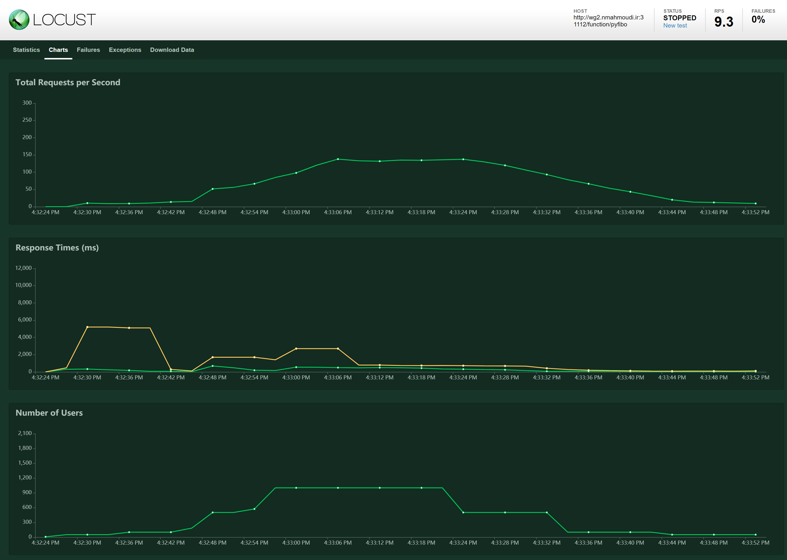
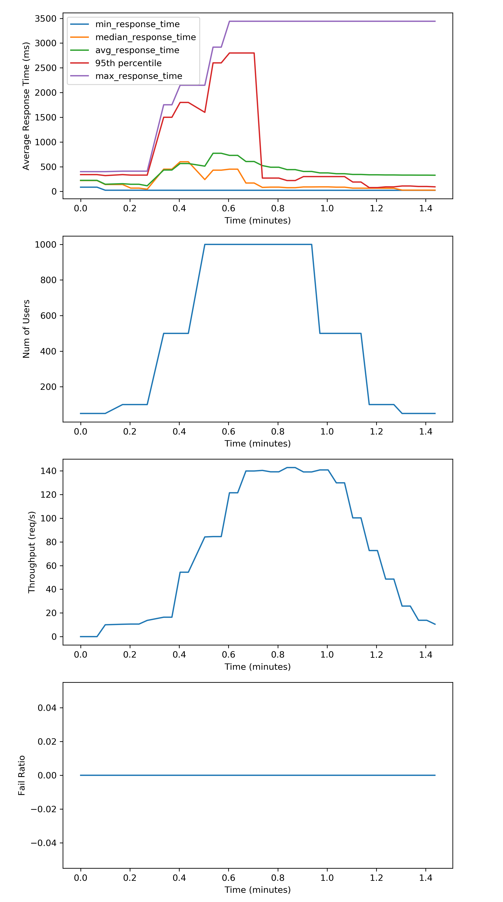

# DDSL Load Tester

The goal of this repo is to create an scalable load tester that can get a load shape as input
and create a user workload based on that.

This load tester uses locust for handling distributed load testing and gathering the statistics 
of the requests.

For further information, read the following urls to get familiar with locust and how to write
a `locustfile.py`:

- [Writing a Locust file](https://docs.locust.io/en/stable/writing-a-locustfile.html)
- [Locust Home Page](https://locust.io/)
- [Locust Github](https://github.com/locustio/locust)
- [How do I Locust](https://github.com/pglass/how-do-i-locust)
- [Locust Web API Code](https://github.com/locustio/locust/blob/master/locust/web.py)


# Installation

```bash
pip install -r requirements.txt
```

For running examples:

```bash
pip install -r examples/requirements.txt
```

# Running The Example

To run the example, change your directory to the `examples/` directory and run the following 
command.

# Starting Locust Server

As mentioned before, the locust library is responsible to make the requests to the target url.
To start the locust server, create a `locustfile.py` and run the following command:

```bash
locust --host=http://THE_TEST_URL
```

This will use the `locustfile.py` or we can specify the file name using -f option.
* Note that one should use two terminals to specify the "THE_TEST_URL" and running the "locustfile.py".  
You can look at the locust dashboard on `http://localhost:8089`. It
will show the stats about the requests and should look like this:



# Usage

In this section, we will mention how the library should be used. Keep in mind that this
library assumes a running instance of locust (read [`starting locust server` section](#starting-locust-server)).

## Adding to PYTHONPATH

To use this library, first you will need to add it to your PYTHONPATH. Here's how:

```python
import sys
sys.path.append("./ddsl_load_tester")
```

You could also use the absolute or any other relative path to the library folder.

## Importing

```python
import ddsl_load_tester as load_tester
```

## Initialization

The `base` variables is the adress to your running locust host.

```python
lt = load_tester.DdslLoadTester(hatch_rate=1000, temp_stat_max_len=5, base='http://localhost:8089/')
lt.change_count(user_sequence[0])
lt.start_capturing()
```

`hatch_rate` is the maximum number of users created in 1 second. `temp_stat_max_len` specifies maximum number of stats
that are going to be collected and kept before getting them using `lt.get_all_stats()`.

Using `change_count(new_count)` you can set the number of users making requests to the server.

After `lt.start_capturing()` is called, a new thread is created that will query the locust server
and store the stats in the `temp_stats` variable. You can read these stats later on using
`lt.get_all_stats()`. Keep in mind that calling this function will clear the temp variable.
So, each time you query this function, you will only get the latest results since your last 
query. The number of temporary stats that are kept is set using `temp_stat_max_len` variable.

Running `lt.stop_test()` will stop the test and kill the thread that is querying locust for
latest stats.

Please note that the locust stats are updated every 2 seconds, thus new stats come in every 2 
seconds as well.

## Getting The Original Stats

For getting the original stats from the locust server (without change):

```python
load_tester.get_current_stats(base='http://localhost:8089/')
```

Example output:

```python
{'current_response_time_percentile_50': None,
 'current_response_time_percentile_95': None,
 'errors': [],
 'fail_ratio': 0.0,
 'state': 'stopped',
 'stats': [{'avg_content_length': 4.0,
   'avg_response_time': 390.2837256558634,
   'current_rps': 8.9,
   'max_response_time': 5086.153268814087,
   'median_response_time': 220,
   'method': 'GET',
   'min_response_time': 22.908926010131836,
   'name': '/function/pyfibo/',
   'num_failures': 0,
   'num_requests': 6230},
  {'avg_content_length': 4.0,
   'avg_response_time': 390.2837256558634,
   'current_rps': 8.9,
   'max_response_time': 5086.153268814087,
   'median_response_time': 220,
   'method': None,
   'min_response_time': 22.908926010131836,
   'name': 'Total',
   'num_failures': 0,
   'num_requests': 6230}],
 'total_rps': 8.9,
 'user_count': 0}
```

## Getting The Temp Stats

The result to `lt.get_all_stats()` is similar to this:

```python
{'time': [1556833594.384781,
  1556833596.38133,
  1556833598.387258,
  1556833600.3843524,
  1556833602.3892365],
 'current_response_time_percentile_50': [26.224613189697266,
  26.224613189697266,
  25.999784469604492,
  25.999784469604492,
  25.91729164123535],
 'current_response_time_percentile_95': [110, 110, 100, 100, 92.8659439086914],
 'fail_ratio': [0.0, 0.0, 0.0, 0.0, 0.0],
 'total_rps': [25.8, 25.8, 13.8, 13.8, 10.5],
 'user_count': [50, 50, 50, 50, 50],
 'avg_response_time': [330.45939713807644,
  330.45939713807644,
  329.39648941742297,
  329.39648941742297,
  327.71034189793136],
 'current_rps': [25.8, 25.8, 13.8, 13.8, 10.5],
 'max_response_time': [3441.922426223755,
  3441.922426223755,
  3441.922426223755,
  3441.922426223755,
  3441.922426223755],
 'median_response_time': [98.92153739929199,
  98.92153739929199,
  98.45185279846191,
  98.45185279846191,
  97.55396842956543],
 'min_response_time': [22.5369930267334,
  22.5369930267334,
  22.5369930267334,
  22.5369930267334,
  22.5369930267334],
 'num_failures': [0, 0, 0, 0, 0],
 'num_requests': [6213, 6213, 6236, 6236, 6273]}
```

## Running a Sequence

This example will run a sequence of number of users, then collect the results in a pandas
`DataFrame`. This can be used to plot and analyze the results later on. The resulting csv
file is saved to the `results/` folder. If this folder doesn't exist, create it using `mkdir`.

```python
import time
import pandas as pd

import sys
sys.path.append("../ddsl_load_tester")

import ddsl_load_tester as load_tester

from tqdm.auto import tqdm
tqdm.pandas()

loop_timer = load_tester.TimerClass()

user_sequence = [50,100,500,1000,1000,1000,500,100,50]
lt = load_tester.DdslLoadTester(hatch_rate=1000, temp_stat_max_len=5, base='http://localhost:8089/')
lt.change_count(user_sequence[0])
lt.start_capturing()

# This value is best to be kept over 10 seconds.
loop_time_in_secs = load_tester.get_loop_time_in_secs('10s')

loop_timer.tic()

results = None
for i in tqdm(range(len(user_sequence))):
    user_count = user_sequence[i]
    lt.change_count(user_count)
    
    # decrement the loop processing time to have an accurate time for the loop
    time.sleep(loop_time_in_secs - loop_timer.toc())
    
    loop_timer.tic()
    
    result = lt.get_all_stats()
    df_result = pd.DataFrame(data=result)
    
    # ANY CONTROL ACTION GOES HERE
    
    if results is None:
        results = df_result
    else:
        results = results.append(df_result)
    
lt.stop_test()

results, filename = lt.prepare_results_from_df(results)

results.head()
```

## Plotting The Results

This will plot the results of running a sequence of different number of users over time.

```python
res = results

import matplotlib.pyplot as plt

%matplotlib inline

plt.figure(figsize=(8,18))
plt.subplot(411)
plt.plot(res['elapsed_min'], res['min_response_time'], label='min_response_time')
plt.plot(res['elapsed_min'], res['current_response_time_percentile_50'], label='median_response_time')
plt.plot(res['elapsed_min'], res['avg_response_time'], label='avg_response_time')
plt.plot(res['elapsed_min'], res['current_response_time_percentile_95'], label='95th percentile')
plt.plot(res['elapsed_min'], res['max_response_time'], label='max_response_time')

plt.xlabel('Time (minutes)')
plt.ylabel('Average Response Time (ms)')
plt.legend()

plt.subplot(412)
plt.plot(res['elapsed_min'], res['user_count'])
plt.xlabel('Time (minutes)')
plt.ylabel('Num of Users')

plt.subplot(413)
plt.plot(res['elapsed_min'], res['total_rps'])
plt.xlabel('Time (minutes)')
plt.ylabel('Throughput (req/s)')

plt.subplot(414)
plt.plot(res['elapsed_min'], res['fail_ratio'])
plt.xlabel('Time (minutes)')
plt.ylabel('Fail Ratio')

filename = filename.replace('.csv', '')
plt.savefig(filename + '.png', dpi=300)
plt.savefig(filename + '.pdf')
plt.show()
```

The resulting figure looks like this:



## Adding Custom Sensing Function

In case you need to sense something other than what is already being measured (like the replication factor) just like other measurements, you can add a `custom_sensing()` function and return a dictionary of the variables that you are trying to sense. Here is an example:

```python
def custom_sensing():
    import random
    return {'random':random.random()}

lt.custom_sensing = custom_sensing
```

These values will appear in the measurements with a prefix of `custom_`. See the example file for a full implementation.
